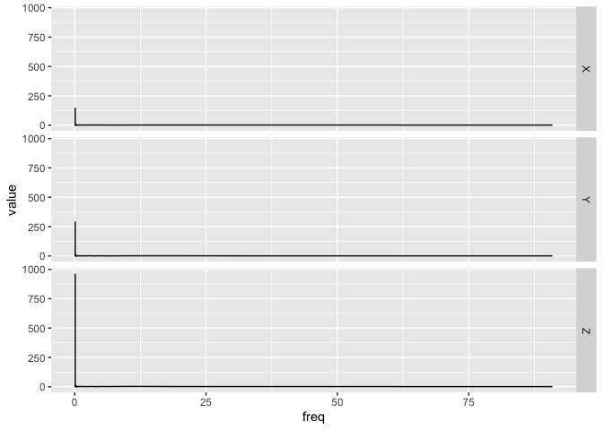

<!-- README.md is generated from README.Rmd. Please edit that file -->

# bis620.2022

<!-- badges: start -->

[](https://github.com/YimingMiao/bis620.2022/actions/workflows/R-CMD-check.yaml)
[](https://github.com/YimingMiao/bis620.2022/actions/workflows/test-coverage.yaml)
[](https://app.codecov.io/gh/YimingMiao/bis620.2022?branch=main)
[](https://github.com/YimingMiao/bis620.2022/actions/workflows/lint.yaml)
<!-- badges: end -->

The package `bis620.2022` contains the UKBiobank Accelerometry Data, and
has functions to plot the time series and create spectral signatures by
taking the modulus of Fourier coefficients of the channels.

[coverage
page](https://app.codecov.io/gh/YimingMiao/bis620.2022?branch=main)

[lint
result](https://github.com/YimingMiao/bis620.2022/actions/workflows/lint.yaml)

## Installation

You can install the development version of bis620.2022 from
[GitHub](https://github.com/) with:

``` r
# install.packages("devtools")
devtools::install_github("YimingMiao/bis620.2022")
```

## Example

``` r
library(bis620.2022)
```

This are some examples showing basic usage of the package:

Acquire data:

``` r
data(ukb_accel)
```

Plot the time-series data:

``` r
accel_plot(ukb_accel[1:1000,])
```


Plot the spectral signatures:

``` r
ukb_accel[1:1000,] |>
  spectral_signature(take_log = FALSE) |>
  accel_plot()
```


